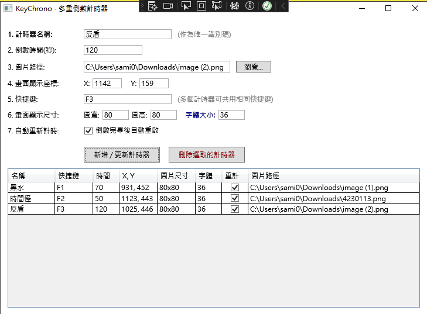

# ⏱️ KeyChrono - 多重倒數計時器 (Multi-Countdown Overlay Timer)

KeyChrono 是一款使用 C# WPF 開發的 Windows 10/11 桌面倒數計時工具。
具備「無邊框、背景透明、強制置頂」等特性，完美融入桌面與實況畫面。支援**同時執行多個獨立計時器**、**全域快捷鍵控制**以及**滑鼠直覺拖曳定位**，非常適合實況主 (VTuber / Streamer)、Speedrun 玩家、簡報演講、或是需要專注力管理的使用者。


---

## ✨ 核心功能特色 (Features)

* **🖱️ 直覺化拖曳定位 (Drag-to-Move)**：啟動計時器後，直接用滑鼠按住拖曳即可改變螢幕位置，放開後會自動同步座標至主介面並於背景存檔。
* **⌨️ 共用快捷鍵 (Shared Hotkeys)**：打破一鍵一計時器的限制！你可以將多個計時器綁定到同一個快捷鍵（例如：按下 `F5` 同時彈出 3 個不同的計時器）。
* **⏯️ 自訂觸發行為 (Retrigger Actions)**：計時器執行中若再次按下快捷鍵，可自訂三種行為： 
	* **重新計時**：無縫將時間補滿並繼續倒數（適合重複刷怪、刷新 BUFF）。 
	* **停止 (預設)**：畫面保留並顯示醒目的 `STOP` 狀態，再按一次即可重新開始。 
	* **暫停**：時間完美凍結，再按一次從中斷的秒數繼續倒數（適合番茄鐘、暫停實況）。
* **🚨 全域緊急關閉 (Global ESC)**：在任何視窗下，只要按下 `Shift+ESC` 鍵，即可瞬間關閉畫面上所有的計時器。你也可以對著單一計時器「點擊右鍵」來單獨關閉它。
* **🖼️ 無邊框透明置頂 UI**：原生支援帶有透明通道的 PNG 圖片，字體帶有高對比黑邊陰影，在任何複雜的背景上都絕對清晰。
* **🔤 獨立排版與字體控制**：可針對每一個計時器自訂「圖片寬高」與「字體大小」，確保文字排版完美契合你的圖片。
* **🔁 自動重置與閃爍提醒**：支援「倒數完畢自動重啟」，且倒數至最後 5 秒時圖片會自動閃爍。
* **💾 設定檔自動儲存**：所有的設定與清單會自動以 JSON 格式儲存於 `%AppData%\KeyChrono`，下次開啟程式無須重新設定。
* **🗣️ 內建 ElevenLabs 語音生成器**：附帶獨立的 TTS 工具，輸入 API Key 與文字，即可輕鬆生成支援中文與多國語言的高品質 MP3 語音檔。**內建高音質男女聲一鍵切換，並支援輸入自訂 Voice ID。**

---

## 📸 畫面預覽 (Screenshots)

*(建議在這裡放上一張主設定介面的截圖)*
> 

*(建議在這裡放上一張多個計時器在桌面上透明置頂倒數、並且顯示 STOP 狀態的截圖)*
> 

### 🎙️ 如何使用 ElevenLabs 語音生成
1. 在主畫面上方的選單列點擊 **「工具 (_T)」** ➔ **「ElevenLabs 語音生成 (TTS)...」**。
2. 於彈出的視窗中貼上你從 ElevenLabs 取得的 API Key (若無 Key 可點擊旁邊的教學按鈕免費註冊取得)。
3. **選擇語音**：可直接使用內建的「女聲」或「男聲」，若想使用其他角色，請選擇「自訂」並貼上對應的 Voice ID。
4. 輸入想要生成的文字內容（支援中文）。
5. 選擇 MP3 存檔路徑後，點擊「生成語音」即可！
---

## 🚀 下載與安裝 (Installation)

### 🎯 直接使用 (給一般使用者)
如果你不想編譯原始碼，可以直接到右側的 **[Releases](../../releases)** 頁面，下載最新打包好的 `.zip` 檔。下載解壓縮後即可點擊執行，免安裝！
*(註：若系統跳出提示，請依照指示安裝 [.NET Desktop Runtime](https://dotnet.microsoft.com/download) )*

### 🛠️ 編譯指南 (給開發者)
1. 確保電腦已安裝 Visual Studio 2022 (包含 `.NET 桌面開發` 工作負載)。
2. 將本專案 Clone 至本地端：
   ```bash
   git clone https://github.com/moring-tw/KeyChrono.git
   ```
   進入專案資料夾，雙擊開啟 KeyChrono.sln 方案檔。

確認無錯誤後，按下 F5 或點擊「開始」即可編譯並執行。
### 📖 使用教學 (How to use)
#### 新增 / 更新設定：
	名稱：輸入計時器名稱（作為唯一識別碼，名稱會以黑底白字顯示在計時器上方）。  
	快捷鍵：設定喚醒按鍵（例如：F8, Ctrl+Q, 數字鍵請使用 D+數字或 Numpad+數字，例如 D4）。  
	執行中按快捷鍵：選擇該計時器被重複觸發時的行為（重新計時 / 停止 / 暫停）。
	點擊「新增 / 更新計時器」，資料會自動寫入下方清單與 Windows AppData 資料夾。  
#### 快速編輯：
在下方清單點擊任何一個計時器，參數會自動填入上方表單，修改後再次點擊「新增/更新」即可覆蓋；或點擊「刪除選取的計時器」來移除。  
#### 啟動計時：
縮小主程式，在任何地方按下你設定的快捷鍵，計時器就會彈出！  
#### 拖曳與關閉：
	拖曳：直接對著圖片按住滑鼠左鍵即可移動計時器。    
	關閉：對著該計時器點擊右鍵，或是按下全域 Shift + ESC 鍵可全部關閉。  
### 📦 依賴開源套件 (Dependencies)
System.Text.Json - 微軟原生高效能 JSON 序列化工具，用於設定檔存取。
### 📄 授權條款 (License)
本專案採用 MIT License 授權，歡迎自由修改、散佈與使用於商業用途。